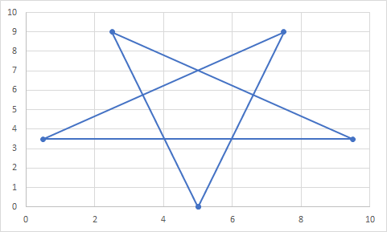
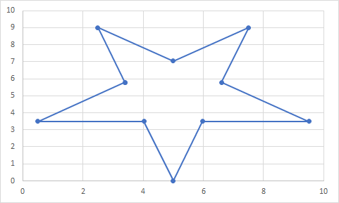
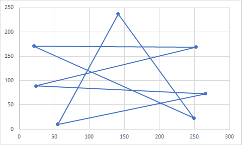
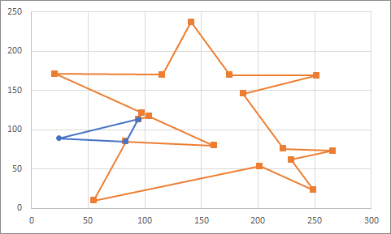
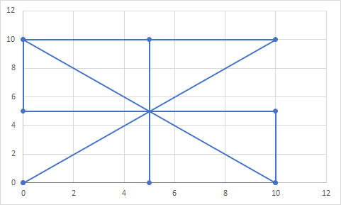
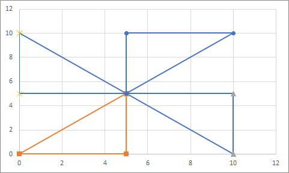

# Dissolve for boost geometry

This project provides a header-only library for removing common failures in polygons for boost geometry. 

The failure this library can remove are: 
- self-intersection
- overlapping inners
- inners outside of the polygon outer
- remove 'spikes' or sub-polygons with very small area

The main purpose of this library is to provide removing self-intersection from polygons using the boost geometry library. For this, a general approach is used. Meaning, for every polygon it can remove self-intersection, possibly generating multiple output polygons

This library provides an approach for the problem described here:

https://barendgehrels.blogspot.com/2011/02/dissolving-pentagram.html

# Usage
This is a header-only library so you can import the header file into your project and use the function 'dissolve' to remove errors from a polygon. For example:

````C++
#include "dissolve.hpp"

namespace bg = boost::geometry;
typedef bg::model::d2::point_xy<double> point;
typedef bg::model::polygon<point> polygon;

int main()
{
	polygon poly;
	boost::geometry::read_wkt("POLYGON((5 0, 2.5 9, 9.5 3.5, 0.5 3.5, 7.5 9, 5 0))", poly);

	double remove_spike_threshold = 1E-12;

	multi_polygon result;
	dissolve::dissolve(poly, result, remove_spike_threshold);

	// Output polygon(s) are valid polygons
	if(boost::geometry::is_valid(result))
		std::cout << "Output polygon is valid" << std::endl;
	else
		std::cout << "Output polygon is not valid" << std::endl;
}
````

# Example 1
First example is a pentagram with self-intersection. 



Self-intersection is removed and a single polygon is generated



# Example 2
Second example is a polygon with a hole inside



After removing the self-intersection, two polygons are generated



# Example 3
Finally an example with multiple intersections at same point



Polygon is converted into multipolygon



# Approach
The approach is an adaptation of the methods described in these papers:

https://web.archive.org/web/20100805164131/http://www.cis.southalabama.edu/~hain/general/Theses/Subramaniam_thesis.pdf

https://www.sciencedirect.com/science/article/abs/pii/S0304397520304199

This approach uses the same approach as the described papers, but with a simpler implementation. Both papers describe how this intersection should be split and that all these intersection points should be visited twice to form the simple subpolygons. Here we just selected a different data structure which makes the implementation even more straightforward than described in these papers. It really is a general approach (for 2d polygons). 

# License
"THE BEER-WARE LICENSE" (Revision 42):

Wouter van Kleunen wrote this file.  As long as you retain this notice you can do whatever you want with this stuff. If we meet some day, and you think this stuff is worth it, you can buy me a beer in return

If you find this library useful, let me know you are using this!
